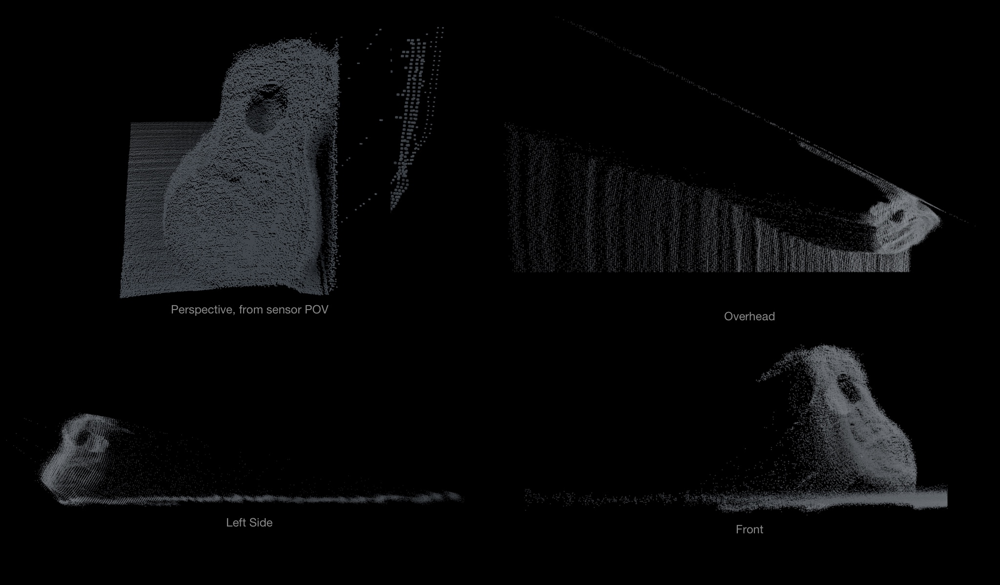

# PulsedLight 3d Scanner: Point-Cloud Tool


***PulsedLight 3d Scanner*** is a point-cloud creation tool created by [PulsedLight, Inc.](pulsedlight3d.com) for the research and experimentation in point-based robotic/computer visualizations. Using a distance sensor, 2 servos, 2 Arduinos (the second one simply provides power) a laptop and a Google Chrome Stand-alone app - point cloud data is captured and export as CSV, PNG and OBJ.

**Contents**

- [Introduction](#introduction)
- [How it Works](#how-it-works)
- [Experiments](#experiments)
- [What's Next? How Can you Help!](#whats-next-how-can-you-help)
- [Appendix A: Scanner Output](#appendix-a-scan-output)
- [Appendix B: Setup & Installation](#appendix-b-setup--installation)
- [Appendix C: Libraries Used](#appendix-c-libraries-used)


## Introduction

Robots and other autonomous machines have a variety of touch-free real-time options for "seeing" the environment around them: radar,  stereoscopic video, high resolution 3D LiDAR scanning and more. With each of these options one primary downside is the high quantity of data coming from the sensors. A robot's vision is only as strong as the algorithms that process the data from the sensors.

The hope with this project was to build a tool that would produce 3D point-cloud data and allow me (and others) to start learning more about the various data-crunching algorithms and processes already available and to tinker with object detection, situational awareness, etc.  

We've been able to create a  2 servo system using LIDAR-Lite v2 sensor that captures relatively high-resolution 3D points. Because of its low cost, it can be a little slow (mostly because of the servos) but it does exactly what I was hoping - it captures and exports the data I needed for experimentation with the algorithm/processing sides of robotic-vision.

Here are a couple samples of the output (and a photo of the scanned scene):


More samples of exports can be viewed in [Appendix A](#appendix-a-scan-output).


## How it Works


When you have followed the directions in "[Appendix B: Installation](#appendix-b-setup--installation)" you simply plug the Arduinos into the laptop and run the chrome app. Once you have selected and connected to the appropriate serial ports, you will see a blank screen with a set of options for the servos and "Export" on the right hand side of the screen.

### Servo Controls
The servo controls are set in "microseconds" and you set the start and stop angle, the number of steps between the readings and the delay between each reading. The start and stop angles are fairly self explanatory - they control where the servo starts and where it finishes reading. The number of steps is also fairly straightforward - it controls how many positions to skip between readings, for example, if the steps is set to 30 and the start is 500 the first reading will be at 500 and the second reading will be at 530. The delay control is set in milliseconds, this controls how long the servo waits at its current position, if this is too low, the servos don't seem to go to their position very accurately. After a certain quantity of delay there's no added benefit to waiting as the servos are as accurate as they will get (in my case 20ms was perfect).

#### Modifying the Servo Controls

If your sensor is hanging down like in the pictures, there's no need to modify anything. If however you'd rather it pivot upwards, you'll need to modify the "invertedSensorAdjustment" variable around line 118 in "main.js":

```javascript
// If your sensor is hanging down, this should be 4500, if it is right side up,
// set to zero. This sets a value in the main serial loop
var invertedSensorAdjustment = 4500;
```

### Changing/Modifying the Distance Sensor

Currently the Arduino software just works with PulsedLight's LIDAR-Lite but it can be modified. In "arduino/PulsedLight3dScanner/PulsedLight3dScanner.ino" around line 53 modify the contents of getDistance() for whatever sensor you'd like to use:

```c++
int getDistance(){
    int distance = 0;
     distance = myLidarLite.distance();
    return distance;  
}
```


### PNG

#### False Color Imagery
Once you have your settings input, hit "Scan now" and a false-color 2D image will be produced. Each color corresponds directly to the distance. In my case the LIDAR-Lite reads in centimeters so each value corresponds to cm readings.

The color is encoded using the standard RGB hex that is common in HTML. The color "Blue" looks like this #0000FF, which breaks down as Red = 0, Green = 0 and Blue = 255 (decimal). This would correspond to a reading of 255cm with the LIDAR-Lite. If we read 256cm the hex code would be #000100 (R = 0, G=1 (decimal), B = 0). In our example 255cm will be bright blue and 256 will be virtually black. For more information on the RGB color see this section of the wikipedia article on RGB: [https://en.wikipedia.org/wiki/RGB\_color\_model#Colors\_in\_web-page\_design](https://en.wikipedia.org/wiki/RGB_color_model#Colors_in_web-page_design)

#### PNG Export

The PNG export is simply the export of the

```html
<canvas></canvas>
```

element that draws the false-color scan. It currently includes all blank margins (canvas size is 4000x4000). The pixels are plotted according to the microseconds, so if you scan from 500-1000 you will have blank margin from 0-499 and from 1001-4000.


### 3D Export (OBJ)

The OBJ export creates a series of cubes positioned based on the Cartesian conversion of the elevation, azimuth and distance measurements. Each cube width and height is proportional to the number of "steps" between each reading. This can be easily modified in the code.

#### Modifying the export
Around line 337 in "main.js" the three.js init() function starts, if you modify the contents of the "array.forEach" you can create different types of 3d export.

Here is the function as is:

```javascript
function init(renderer, scene) {
	var array = CSVToArray(blob);
	array.forEach(function(entry) {
		if(!isNaN(entry[0]) || !isNaN(entry[1]) || !isNaN(entry[2])){
			var radius = entry[2];
			var azimuth = entry[0];
			var elevation = entry[1];
			// Convert radial points to Cartesian points
			var elevation2 = ((90 - ((elevation - 500) * 0.09)) / 90) * (Math.PI / 2);
			var azimuth2 = ((90 - ((azimuth - 1000) * 0.09)) / 90) * (Math.PI / 2);
			var myX = (radius * Math.sin(elevation2) * Math.cos(azimuth2));
			var myZ = (radius * Math.sin(elevation2) * Math.sin(azimuth2));
			var myY = -(radius * Math.cos(elevation2));
			// End radial->Cartesian conversion

			// Use this line if you want the size of the cubes to be a function of the
			// steps between points
			var cubeSize = entry[3]/8;
			// var cubeSize = 2;
			var geometry2 = new THREE.BoxGeometry(cubeSize, cubeSize, cubeSize);
			var mesh2 = new THREE.Mesh(geometry2, material);
			mesh2.position.x = myX;
			mesh2.position.z = myZ;
			mesh2.position.y = myY;
			scene.add(mesh2);
		}
	});
	container = document.getElementById('container2');
	container.appendChild(renderer.domElement);
	window.addEventListener('resize', onWindowResize, false);
	animate();
}
```

This is the function to modify, if points, spheres or a mesh were desired instead of cubes.


### CSV Export
The CSV data is exported as

```csv
//Azimuth Rotation, Elevation Rotation, Distance, steps between azimuth, steps between elevation
1500,500,60,4,4
```

#### Modifying the Export

In the code you can easily modify this to export whatever you need (including header rows), by changing this function and altering the "blob" variable:

```javascript
$('#exportCSV').click(function() {
	// To add a header row to CSV append the header to the being of
	// the "blob" variable
	var config = {
		type: 'saveFile',
		suggestedName: event.timeStamp + '.csv'
	};
	chrome.fileSystem.chooseEntry(config, function(writableEntry) {
		var blobSave = new Blob([blob], {
			type: 'text/plain'
		});
		writeFileEntry(writableEntry, blobSave, function(e) {});
	});
});
```

## Experiments

Below are the results of variations in the steps and delay settings while scanning at the scene from ["Appendix A: Scan Output - Guitar"](#guitar).

### Step Variation

*The results of changing the steps between readings.*

### Notes
- Each scan used the same area (Azimuth: 1200-1500, Elevation: 640-940)
- When using steps 1 & 2, multiple scans were required and the app crashed when attempting to do an OBJ export of the full image. For 2 steps, 2 half scans were created and assembled. For 1 step, 10 scans were created and assembled.

### Delay Variation

*The results of changing the delay between readings.*


## What's Next? How can you help!?
Be sure to check back periodically as this is very much a work-in-progress. Some of the things on the list...

1. Export 3D Meshes: We'd love some help with this! As best as we can tell, a nearest neighbor algorithm is going to end up as part of the mix.
2. Situational Awareness:  The goal here is the ability to take two scans from different positions, and have the scanner recognize its two positions relative to one another and the scanned environment
3. Keep tweaking and documenting the code

If anyone has any ideas or code to contribute to this project, please do a pull or start an issue. Thank you so much in advance.

***NOTE****:  Concerning troubleshooting! If you have a question, ask it, I will do my best to respond, but because of limited time, I will not be able to walk anyone through process of setting up Arduino, Chrome Extensions, etc. *

----

## Appendix A: Scan Output

### Guitar
The scan below is at the highest possible resolution and does not show typical results. Review the contents of the "examples_and_assets/guitar/" folders for other scan settings, or review ["Experiments"](#experiments) above.


*PNG output*
<p></p>

*3D OBJ export, rendered in 3d modeling software*
<p></p>

*Photo of scene being scanned*
<p></p>
#### Export files
Review the "examples_and_assets/guitar" folder for all of the exports. There are about 36 files of raw data in that folder.

### Chair


*PNG output*
<p></p>

*3D OBJ export, rendered in 3d modeling software*
<p></p>

*Photo of scene being scanned*
<p></p>
#### Export files
- [Chair OBJ](examples_and_assets/chair/chair.obj)
- [Chair PNG](examples_and_assets/chair/chair.png)
- [Chair CSV](examples_and_assets/chair/chair.csv)

### Backdoor

*PNG output*
<p></p>

*3D OBJ export, rendered in 3d modeling software*
<p></p>

*Photo of scene being scanned*
<p></p>
#### Export files
- [Backdoor OBJ](examples_and_assets/backdoor/backdoor.obj)
- [Backdoor PNG](examples_and_assets/backdoor/backdoor.png)
- [Backdoor CSV](examples_and_assets/backdoor/backdoor.csv)

----

## Appendix B: Setup & Installation
#### Parts List
Here is the list of hardware I used.
- 1 x LIDAR-Lite v2 (Blue Label)
- [2 x Servos with Pan/Tilt Kit via Robotshop](http://www.robotshop.com/en/lynxmotion-pan-and-tilt-kit-aluminium2.html "Lynxmotion Pan and Tilt Kit w/ 2 Servos (via Robotshop)")
- 2 x Arduinos (one is exclusively for power and could easily be replaced with a power supply), I used 1 x UNO rev3 and one Nano for power
- A mount for the servos (I used a [PanaVise Model 201 "Junior" Miniature Vise](http://www.amazon.com/gp/product/B000B61D22/ref=s9_al_bw_g328_i2))
- A camera tripod for positioning the scanner
- Electrical tape
- Two long USB cables!

#### Arduino Setup


To install the Arduino software, open "arduino/PulsedLight3dScanner/PulsedLight3dScanner.ino" and upload it to the main Arduino. You will need to [install the "LIDARLite" Arduino library](https://github.com/PulsedLight3D/LIDARLite_v2_Arduino_Library).

#### Hardware Setup

Below you'll see a few pictures of the fully assembled "rig". I let the PanaVise hold the servo/sensor assembly and zip-tied the arduinos to the top of the PanaVise. I used electrical tape to attach the PanaVise to the tripod.

***NOTE*** *: I chose to hang the sensor down from the vice grip as show in the image below (if you want to allow the pan head to pan upwards, you'll need to modify the code as outlined in ["How it works: Modifying the Servo Controls"](#modifying-the-servo-controls)).*

### Software
The software side is relatively straight forward:

1. Download and decompress this repository
2. Install Google Chrome
2. Type "chrome://extensions" into the URL address box
3. Make sure the "Developer mode" checkbox is checked on the top right of the screen
4. Click the button right under the "Extensions" heading called "Load unpacked extension"
5. Select the repository folder. It will now "install"
6. You can now hit launch from the extension page, or navigate to "chrome://apps" and launch it there.
7. On launching you will see a screen to "choose serial port" select your Arduino and click "connect"

#### Hacking the Chrome Code
Whenever you make updates to the Chrome code while running the app, you will need to restart the app using the "reload" button on the interface, or by right clicking and selecting "Reload App"

#### Hacking the Arduino Code
Whenever you make changes to the Arduino code and attempt to commit them to the Arduino while running the app, the Arduino and Chrome softwares will compete for the serial connection to the Arduino hardware. Typically it is best to close the Chrome app before attempting to upload code to the Arduino  via the Arduino IDE. Once the upload is complete you can relaunch the Chrome app and connect as usual.

----

## Appendix C: Libraries Used
### Chrome App
- [Two.js](http://jonobr1.github.io/two.js/)
- [Three.js](http://threejs.org)
- [Chrome App Samples (specifically "serial")](https://github.com/GoogleChrome/chrome-app-samples)
- [Jquery](http://jquery.com)

### Arduino
- [Servos](https://www.arduino.cc/en/Reference/Servo)
- [LIDARLite](https://github.com/PulsedLight3D/LIDARLite_v2_Arduino_Library)
